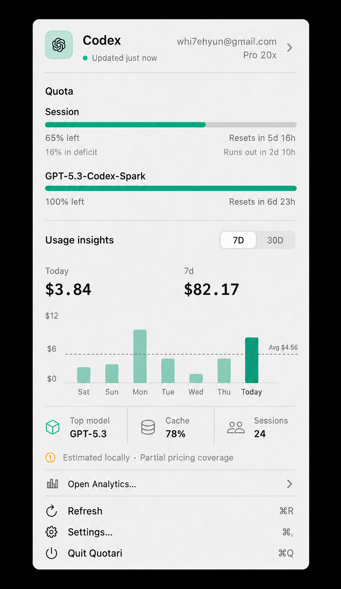

# Usage Insights Product Specification

Status: Proposed

Last updated: 2026-07-23

The image is a directional composition reference, not a source of product
truth. Labels must follow the active period, and optional cells shown in the
fixture appear only when their source data passes the availability rules below.

## Summary

Usage Insights expands Quotari from a live quota companion into a compact,
trustworthy view of local AI usage and estimated cost.

The menu-bar popover remains the fastest place to answer:

- How much quota is left?
- How much did I use today?
- Is usage trending up or down?
- Which model contributed most?
- Is the underlying estimate complete?

Deeper history and breakdowns belong in a separate Analytics window so the
popover remains a focused macOS utility rather than a full dashboard.

## Problem

Quotari already displays live provider quota, 30-day local estimated cost,
tokens, a daily chart, and the top model. The current presentation has several
limitations:

1. Remaining quota is the only optional value available beside the menu-bar
   mascot.
2. The cost chart is fixed to 30 days and does not establish a clear visual
   hierarchy between today, the selected period, and supporting metrics.
3. Pricing warnings can occupy more attention than the useful estimate.
4. The data model discards token-type and model-level details that could support
   trustworthy insights.
5. Local usage changes are discovered through scheduled refreshes rather than
   promptly after log updates.
6. Adding more detail directly to every provider card would make the 300-point
   popover difficult to scan.

## Product principles

### Accuracy before completeness

Unknown, unattributed, or unsupported values must remain unavailable. They must
not be displayed as zero or assigned to the first available account.

### Local-first by default

Usage Insights adds no server, account, telemetry, or social dependency. Raw
session logs and derived aggregates stay on the Mac.

### Progressive disclosure

The popover shows quota and a compact trend. The Analytics window explains the
trend and provides more history.

### Explicit provenance

Every estimate retains provider, account scope, source type, freshness, and
coverage. Local roots without per-record account identity must remain labeled
as not account-specific.

### Native compactness

The existing 300-point popover width and 560-point maximum height remain the
layout contract. Additional content may scroll vertically but must not create
horizontal scrolling.

## Goals

1. Allow users to choose remaining quota or today's estimated cost as the
   menu-bar value.
2. Present a compact 7-day or 30-day usage trend for each enabled provider's
   selected account.
3. Show model, cache, and session insights only when their inputs are
   trustworthy.
4. Replace long inline pricing warnings with a concise coverage state and an
   accessible explanation.
5. Open a dedicated Analytics window from the relevant provider card.
6. Refresh local insights after relevant session logs change, while retaining
   scheduled refresh as a fallback.
7. Preserve all current account-attribution, stale-data, cancellation, and
   pricing-coverage protections.
8. Support English and Korean at launch.

## Non-goals

The first release does not include:

- leaderboards, profiles, chat, or social sharing;
- cloud history or multi-device synchronization;
- salary comparisons or novelty spending conversions;
- Discord, Slack, or Telegram webhooks;
- raw prompt, response, path, or shell-command storage;
- project, tool, shell, or MCP breakdowns;
- additional AI providers;
- a replacement for provider-reported live quota;
- lifetime or yearly history.

Project and tool analytics may be reconsidered after the local aggregation and
privacy model are proven.

## Primary jobs to be done

### Quick check

When I glance at the menu bar, I want to see the metric I care about without
opening Quotari.

### Daily understanding

When I open Quotari, I want today's estimated cost and the recent trend beside
my quota so I can decide whether to slow down or continue.

### Trust

When an estimate is partial or cannot be scoped to the selected account, I want
Quotari to say so clearly instead of presenting a precise-looking total.

### Investigation

When a trend looks unusual, I want to open a larger Analytics window and inspect
the period, models, token categories, and data coverage.

## Scope

### 1. Menu-bar metric

Replace the `Show remaining quota` Boolean with a display mode:

- `Hidden`
- `Remaining quota`
- `Today cost`

Quota and cost keep separate sources:

- `Remaining quota` preserves the existing `Most constrained` or explicit
  provider source.
- `Today cost` requires its own explicit provider source and uses that
  provider's currently selected dashboard account.
- Choosing `Today cost` never silently selects a provider. Until the user
  chooses one, the Settings row shows `Choose a cost source` and the menu bar
  shows the mascot only.
- Disabling the selected cost provider preserves the preference but makes the
  value unavailable. Quotari does not silently move the cost to another
  provider.

Version 1 does not sum providers. This avoids presenting a partial
cross-provider total when one provider has unavailable pricing, a different
currency, or no account-scoped logs.

`Today cost` comes only from a successful local daily aggregate for the
selected scope. Provider-reported period cost, remaining credits, or lifetime
spend are not eligible because they do not prove today's activity.

Display rules:

- Complete estimate: `$3.84`
- Partial estimate: `≈$3.84`
- Unavailable or stale beyond policy: mascot only
- No local activity: `$0.00` only when a successful, correctly scoped scan
  confirms zero activity
- Shared local cache scope: eligible only when its provider is the explicit cost
  source, displayed with `≈`, and announced as not account-specific

A cached value can remain visible during refresh only when it belongs to the
same scope and local calendar day. After local midnight, today's cost is
unavailable until the new day's scoped scan succeeds.

A transient read failure or a provider row with unsupported token fields keeps
the last valid same-scope value. Only a successful zero-activity scan or a
confirmed absence of local log roots clears the local cost presentation.

The accessibility label must include provider, value, estimate coverage, and
freshness.

Existing preferences migrate as follows:

- `showsRemainingPercent == true` becomes `Remaining quota`
- `showsRemainingPercent == false` becomes `Hidden`
- the existing usage source becomes the quota source
- the new cost source starts unset

### 2. Compact Usage Insights section

The existing cost section evolves into `Usage Insights`.

The section follows the account currently selected in that provider card only
when its logs carry provable account identity. Credential-root history without
per-record identity is presented as shared local data and never attributed to a
different saved account.

Content order:

1. Section title and `7D / 30D` period picker
2. `Today` and selected-period cost, or trustworthy token totals when pricing is
   unavailable
3. Daily bar chart with an average rule, using the same cost-or-token metric
4. Available insight cells
5. Concise provenance and pricing coverage
6. `Open Analytics…`

Density rules:

- With one enabled provider, its section starts expanded.
- With multiple enabled providers, Usage Insights behaves as an accordion and
  at most one provider section is expanded.
- A collapsed section retains `Today`, the selected-period total, and its
  availability state so another provider can still be compared without opening
  it.
- The first enabled provider with scoped local insights starts expanded when
  the dashboard opens. Expansion is local view state and does not persist.
- A provider-reported cost with no scoped local aggregate remains a compact
  reported-cost row. It does not show the period picker, local chart, optional
  cells, or `Open Analytics…`.

Period rules:

- The popover defaults to `7D`.
- `7D` and `30D` are consecutive local calendar days ending today.
- `Today` always represents the current local calendar day.
- The second metric, chart, top model, cache rate, and session count all use the
  selected period.
- The second metric label must match the active picker value (`7d` or `30d`).
- Cost is the preferred chart and headline metric when it is complete or
  partial. When pricing is unavailable but total tokens are trustworthy, both
  switch to tokens and show an explicit token unit.
- The average rule is the arithmetic mean of all displayed calendar buckets,
  including zero-activity days and the current partial day.
- Period selection is local view state in version 1 and does not persist.

Insight cells:

- `Top model`: available when model attribution exists; rank by usable spend,
  then trustworthy total tokens.
- `Cache`: available only when the cache numerator and input denominator are
  both trustworthy for the provider and period.
- `Sessions`: available only when stable session identity exists.

Unavailable cells are omitted and the remaining cells reflow. They are not
rendered as zero.

### 3. Analytics window

`Open Analytics…` is available only after Quotari has a successful local
aggregate for a known or explicitly shared scope. It dismisses the popover and
opens one reusable, resizable window focused on the originating provider,
account, and popover period. Provider-reported-only cost does not enable the
window.

Provider and account controls inside Analytics are window-local filters. They
list enabled providers and known accounts, do not change the dashboard's
selected account, and show the appropriate unavailable state for a saved
account without local logs. Reopening Analytics from a provider card resets the
window context and period to that card.

Version 1 contains:

- provider and account context;
- 7-day and 30-day period selection;
- today and period totals;
- daily cost or token chart;
- model breakdown;
- input, output, cache-read, and cache-write totals when available;
- cache efficiency when valid;
- sessions when valid;
- data source, account scope, freshness, and pricing coverage.

The Analytics window does not add a new global shortcut in version 1. The
existing dashboard shortcut continues to open the menu-bar dashboard.

### 4. Event-driven local refresh

Quotari observes the effective local log roots for each enabled provider's
selected dashboard account. While Analytics is open on a different account, its
scope is observed as well.

Requirements:

- react to create, write, rename, and delete events for relevant session logs;
- canonicalize and deduplicate watched roots;
- coalesce normal activity for approximately two seconds;
- extend coalescing up to approximately 30 seconds during sustained writes;
- refresh only the affected provider and account scope;
- keep parsing and aggregation off the main actor;
- retain the scheduled provider refresh and manual Refresh action as fallbacks;
- reconfigure roots after account discovery, selection, or CLI switching;
- stop observing an Analytics-only scope when the window closes.

The UI keeps the last valid insight while a background recalculation runs.

## Data truth and coverage rules

### Account scope

| Source | Account scope | Product behavior |
| --- | --- | --- |
| Selected Codex auth directory | Shared local cache | Show as not account-specific |
| Selected Claude credentials directory | Shared local cache | Show as not account-specific |
| Claude keychain or environment | Shared local cache | Show with `Not account-specific` label |
| Quotari saved registry account | No local logs | Do not attribute active CLI logs |
| Missing or ambiguous identity | Unknown | Do not show account-specific insights |

### Metric availability

Claude session rows can contain placeholder input and output values. Quotari
must not use those fields merely because another parser does.

- Pricing uses only token fields already accepted by provider-specific parser
  rules.
- Cache efficiency requires a trustworthy denominator and is unavailable
  otherwise.
- Session count requires a stable session identifier after deduplication.
- A session with unsupported token fields still contributes its stable session
  identity; mixed supported and unsupported sessions mark affected totals as
  partial instead of silently dropping the unsupported session.
- A provider can launch without session count support; the cell appears only
  after its parser has a tested stable identity.
- Model totals inherit the pricing coverage of their underlying records.
- Partial pricing remains visible as an estimate but uses `≈` and a coverage
  disclosure.

## States

### Loaded

Show the selected period, chart, available insight cells, and provenance.

### Refreshing with cached data

Keep the last valid data visible and show a subtle progress indicator. Do not
replace the section with a spinner.

### First calculation

Show a compact `Calculating local usage…` placeholder.

### No activity

Show `No local activity in this period` only after a successful scoped scan.

### Unavailable

Explain the specific reason:

- no local logs for the saved account;
- metrics are not account-specific;
- pricing unavailable;
- token breakdown unsupported;
- scan failed.

### Partial

Show the usable estimate with `≈`, a small amber status mark, and a disclosure
containing missing model pricing or scope details.

### Stale

Keep the last valid value, label its freshness, and allow manual retry.
Transient scan failures and unsupported replacements enter this state rather
than the no-activity state.

## Accessibility and localization

- All controls must have explicit English and Korean localizations.
- The chart must expose an accessible summary and individual day values.
- Color is never the only indicator of partial, stale, or unavailable data.
- Numeric text uses monospaced digits and locale-aware currency formatting.
- Long model names truncate visually but remain available to accessibility.
- The period picker and `Open Analytics…` are keyboard reachable.

## Success criteria

The release is successful when:

1. Existing menu-bar preferences migrate without changing visible behavior.
2. Unknown or unavailable metrics never appear as zero.
3. No provider or saved account receives usage from an unrelated local log
   scope.
4. A relevant log update refreshes the affected insight after coalescing,
   without a manual refresh.
5. The popover remains 300 points wide and capped at 560 points high in English
   and Korean.
6. Loaded, partial, unavailable, stale, no-activity, and refreshing states have
   deterministic tests or snapshots.
7. The feature adds no network request and persists no raw session content.
8. Existing live quota and notification behavior remains unchanged.
9. The selected-period label, total, chart, and insight cells always represent
   the same date range.
10. With two enabled providers, one collapsed and one expanded card fit the
    300-point width without horizontal scrolling, and both remain keyboard
    reachable through the vertically capped scroll view.

## Delivery sequence

### Milestone A — Analytics foundation

- Add structured local usage aggregates and explicit metric availability.
- Preserve the existing `CostSummary` behavior through an adapter.
- Add provider and account-scoped cache schema versioning.

### Milestone B — Event-driven freshness

- Add the log change monitor and provider-scoped invalidation.
- Retain polling and manual refresh fallbacks.

### Milestone C — Menu-bar and popover

- Migrate menu-bar display preferences.
- Add `Today cost`.
- Replace the current cost block with the compact Usage Insights section.

### Milestone D — Analytics window

- Add the reusable window, filters, charts, breakdowns, previews, and snapshots.

### Milestone E — Follow-up evaluation

- Measure whether users need 90-day history, projects, tool usage, MCP usage, or
  export.

## Deferred questions

These questions do not block foundation work:

1. Should a future combined menu-bar cost show only complete providers or show
   a visibly partial aggregate?
2. Should 90-day local aggregate persistence precede project-level analytics?
